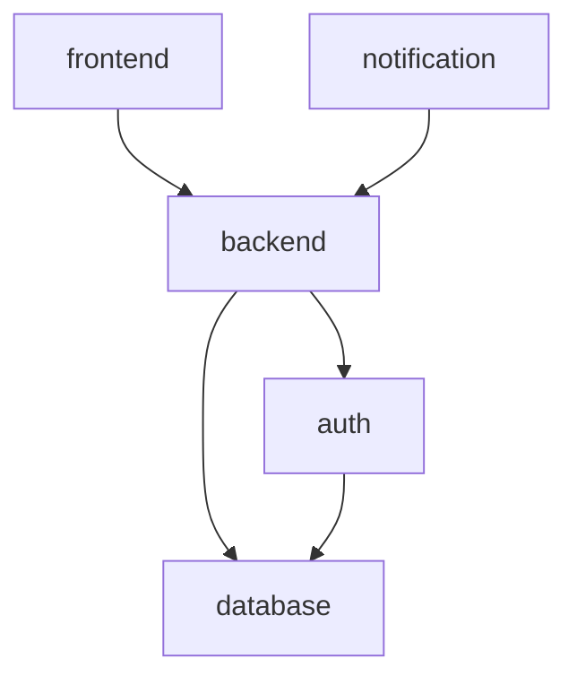

### A command line tool for the orchestration of Kubernetes reconfigurations, built on top of **CestrumCore**.

# Requirements
- A macOS operating system (full Unix support will be brought back soon)
- [Swift 6.0 or later](https://www.swift.org/install/macos/)
- Kubernetes with a working cluster (e.g., Minikube)
- DOT GraphViz

Swift is only required for building and installing Cestrum — no knowledge of the Swift programming language is required.

# Setup
1) Open the `cestrum-cli` folder in Terminal (where there is the `Package.swift` file).
2) Build the binary, by running:
  ```bash
  swift build --configuration release
  ```
3) In the same Terminal window, move the binary to the binary directory, by running:
  ```bash
  sudo cp -f .build/release/cestrum /usr/local/bin/cestrum
  ```
4) Verify the installation by either running `cestrum --version` or `cestrum -h`

# Getting Started
On top of Kubernetes' concept of [Deployments](https://kubernetes.io/docs/concepts/workloads/controllers/deployment/), 
Cestrum defines three main concepts and relies heavily on them, and they are: 
- *Configuration*, which is a high level description of a dependency graph of K8s deployments;
- *Reconfiguration*, which represents a high-level plan describing intended structural changes to a Configuration;
- and *CESR*, an interpreted language for expressing reconfigurations.

Further details about these concepts can be found on `CestrumCore`'s [documentation](https://github.com/Wadye17/CestrumCore) (coming soon on GitHub,
obtainable now via DocC on Xcode).


Consider the following quick example of a Cestrum configuration.



## Register a New Configuration
One can *describe* configurations using JSON in a high level manner inside a `.cesc` (with a **c**, for "configuration") file.

In the running example, the configuration can be described like the following:
```json
{
	"namespace": "example",
	"deployments": ["database", "frontend", "auth", "backend", "notification"],
	"dependencies": [
		{ "source": "frontend",        	"target": "backend" },
		{ "source": "notification", 	"target": "backend" },
		{ "source": "backend", 		"target": "auth" },
		{ "source": "backend",        	"target": "database" },
		{ "source": "auth",     	"target": "database" },
	]
}
```

Then, in the terminal, run:
```bash
cestrum new <path/to/config-description.cesc>
```
Cestrum creates an actual instance of that configuration from its description
and saves it in its internal directory. The configuration's name is the value of the `namespace` field specified in the desciption.

If the configuration is entirely new and empty even on Kubernetes, simply run:
```bash
cestrum new empty <config-name>
```

## View a Configuration
Cestrum allows to view a registered configuration textually—for now, graphical support will be added in the future—by running:
```bash
cestrum view <configuration-name>
```
In the running example, it would be `cestrum view example`.

Cestrum will print the following:
```
[Configuration] 'doc':
graph doc {
    deployments {frontend, backend, auth-service, notification-service, database}
    dependencies {
      	frontend -> backend
	notification -> backend
	backend -> auth
	backend -> database
	auth -> database
    }
}
```

## Plan a Reconfiguration
The purpose of planning a reconfiguration is to be able to see what the actual, 
low-level operations will be (stopping, removing, adding, and starting deployments),
instead of directly applying them.

Reconfigurations are written in the CESR language, in files ending with `.cesr` (with an **r**, for "reconfiguration").

For instance, in the running example, we would like to replace the deployment `server_1` with another, say `new_server_1`;
in CESR, such a reconfiguration can be expressed as:

```
configuration "example";
replace backend with new-backend "path/to/new-backend.yml";
replace database with new-database "path/to/new-database.yaml";
```

The `configuration` expression (which is required in every CESR code), 
allows Cestrum to invoke the configuration instance on which we would like to plan the reconfiguration.

### Sequential Plan
The sequential plan is an ordered list of concrete operations, executed one after the other.

```bash
cestrum plan <path/to/reconfig-file.cesr>
```

Cestrum will then generate and print out the sequential plan.
Running the example reconfiguration would print something like:

```
[Concrete Plan]:
stop frontend
stop notification-service
stop backend
stop auth-service
stop database
remove database
remove backend
add new-database
add new-backend
start new-database
start auth-service
start new-backend
start frontend
start notification-service
```

Additonally, one may wish to print the abstract formula (again), or even the actual Kubernetes `kubectl` commands equivalent to the concrete plan, 
by adding the `-a` (or `--abstract`) and `-k`(or `--k8s`) flags, respectively.

### Parallelisable Plan
The parallelisable plan is an executable BPMN structure that groups the concrete operations in a workflow.
Operations are run in parallel where safe (according to the dependencies).

```bash
cestrum plan async <path/to/reconfig-file.cesr>
```

Cestrum will automatically build the BPMN workflow and render it.
For the example, we get:

IMAGE, PLEASE!

## Apply a Reconfiguration
Applying a reconfiguration works almost the same way as planning it, except it will actually:
1) Apply the reconfiguration concrete plan (regardless of its type—sequential or parallelisable) on Kubernetes by executing the generated plan through `kubectl` commands.
2) Mutates the existing configuration and saves it.

```bash
cestrum apply <sync* | async> <path/to/reconfig-file.cesr>
```

For testing purposes, you can skip the execution on Kubernetes, by enabling the `--no-k8s` flag.
Additionally, by default, unlike `plan`, `apply` does not print out the generated low-level plan,
however, you can still make Cestrum print it out and wait for your confirmation before proceeding 
to the application of the reconfiguration, by adding `-a` (or `--ask-confirmation`).

> [!IMPORTANT]
> Cestrum currently assumes that Kubernetes is installed and up and running, errors that can be raised by Kubernetes are not handled by Cestrum.

## Override a Configuration
For safety purposes, Cestrum does not allow registering a configuration with the name of one that 
already exists; it will raise a warning telling you that a configuration with such a name is already registered, then exits with `exit code 2`.

However, you can *override* an existing configuration instead.

```bash
cestrum override <path/to/config-description.cesc>
```

## Remove a Configuration
Finally, you can also remove a configuration from Cestrum (independently of Kubernetes), by running:
```bash
cestrum remove <configuration-name>
```

---

> [!WARNING]
> Cestrum is still in its alpha stage, and is only available for experimental use; it is not ready to be used for production.
