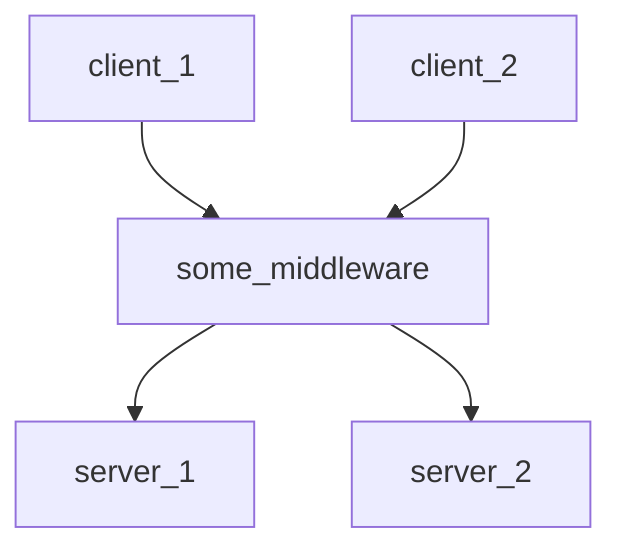

### A command line tool for the orchestration of Kubernetes reconfigurations, built on top of **CestrumCore**.

# Requirements
- A Unix operating system (macOS or Linux)
- [Swift 6.0 or later](https://www.swift.org/install/macos/)
- Kubernetes (with a working cluster, e.g., Minikube)

Swift is only required for building and installing Cestrum — no knowledge of the Swift programming language is required.

# Setup
1) Open the `cestrum-cli` folder in Terminal (where there is the `Package.swift` file).
2) Build the binary, by running:
  ```bash
  swift build --configuration release
  ```
3) In the same Terminal window, move the binary the binary directory, by running:
  ```bash
  sudo cp -f .build/release/cestrum /usr/local/bin/cestrum
  ```
4) Verify the installation by either running `cestrum --version` or `cestrum -h`

# Getting Started
On top of Kubernetes' concept of [Deployments](https://kubernetes.io/docs/concepts/workloads/controllers/deployment/), 
Cestrum defines three main concepts and relies heavily on them, and they are: 
- *Configuration*, which is a high level description of a dependency graph of K8s deployments;
- *Reconfiguration*, which represents a high-level plan describing intended structural changes to a Configuration;
- and *CESR*, an interpreted language for expressing reconfigurations.

Further details about these concepts can be found on `CestrumCore`'s [documentation](https://github.com/Wadye17/CestrumCore) (coming soon).


Consider the following quick example of a Cestrum configuration.



## Register a New Configuration
You can *describe* configurations using JSON in a high level manner inside a `.cesc` (with a **c**, for "configuration") file.

In the running example, the configuration can be described like the following:
```json
{
	"namespace": "doc",
	"deployments": ["client_1", "client_2", "some_middleware", "server_1", "server_2"],
	"dependencies": [
		{ "source": "client_1",        "target": "some_middleware" },
		{ "source": "some_middleware", "target": "server_1" },
		{ "source": "some_middleware", "target": "server_2" },
		{ "source": "client_2",        "target": "some_middleware" }
	]
}
```

Then, in the terminal, run:
```bash
cestrum new <path/to/config-description.cesc>
```
Cestrum creates an actual instance of that configuration from its description
and saves it in its internal directory. The configuration's name is the value of the `namespace` field specified in the desciption, `doc` in the example.


## View a Configuration
Cestrum allows to view a registered configuration textually—for now, graphical support will be added in the future—by running:
```bash
cestrum view <configuration-name>
```
In the running example, it would be `cestrum view doc`.

Cestrum will print the following:
```
[Configuration] 'doc':
graph doc {
    deployments {client_1, client_2, server_1, server_2, some_middleware}
    dependencies {
      	(client_1 --> some_middleware)
	(client_2 --> some_middleware)
	(some_middleware --> server_1)
	(some_middleware --> server_2)
    }
}
```

## Plan a Reconfiguration
The purpose of planning a reconfiguration is to be able to see what the actual, 
low-level operations will be (stopping, removing, adding, and starting deployments),
instead of directly applying them.

Reconfigurations are written in the CESR language, in files ending with `.cesr` (with a **r**, for "reconfiguration").

For instance, in the running example, we would like to replace the deployment `server_1` with another, say `new_server_1`;
in CESR, such a reconfiguration can be expressed as:

```
hook "doc";
replace server_1 with new_server_1 "path/to/manifest.yml";
```

The hook instruction (which is required in every CESR code), 
allows Cestrum to invoke the configuration instance on which we would like to plan the reconfiguration.

```bash
cestrum plan <path/to/reconfig-file.cesr>
```

Cestrum will then generate and print out the concrete plan, which is the human-readable sequence of instructions to perform with respect to the dependencies.
Running the example reconfiguration would print:

```
[Concrete Plan]:
stop client_1
stop client_2
stop some_middleware
stop server_1
remove server_1
add new_server_1
start new_server_1
start some_middleware
start client_1
start client_2
```

Additonally, one may wish to print the abstract formula (again), or even the actual Kubernetes `kubectl` commands equivalent to the concrete plan, 
by adding the `-a` (or `--abstract`) and `-k`(or `--k8s`) flags, respectively.

## Apply a Reconfiguration
Applying a reconfiguration works almost the same way as planning it, except it will actually:
1) Apply the reconfiguration low-level plan on Kubernetes by running the respective sequence of `kubectl` commands.
2) Mutates the existing configuration and saves it.

```bash
cestrum apply <path/to/reconfig-file.cesr>
```

For testing purposes, you can skip the execution on Kubernetes, by enabling the `--no-k8s` flag.
Additionally, by default, unlike `plan`, `apply` does not print out the generated low-level plan,
however, you can still make Cestrum print it out and wait for your confirmation before proceeding 
to the application of the reconfiguration by adding `-a` (or `--ask-confirmation`).

> [!NOTE]
> For *experimental* purposes, after each `kubectl` command execution, the process sleeps for 3 seconds.

> [!IMPORTANT]
> Cestrum currently assumes that Kubernetes is installed and up and running, errors that can be raised by Kubernetes are not handled by Cestrum.

## Override a Configuration
For safety purposes, Cestrum does not allow registering a configuration with the name of one that 
already exists; it will raise a warning telling you that a configuration with such a name is already registered, then exits with `exit code 2`.

However, you can *override* an existing configuration instead.

```bash
cestrum override <path/to/config-description.cesc>
```

## Remove a Configuration
Finally, you can also remove a configuration from Cestrum (independently of Kubernetes), by running:
```bash
cestrum remove <configuration-name>
```

---

> [!WARNING]
> Cestrum is still in its alpha stage, and is only available for experimental use; it is not ready to be used for production.
